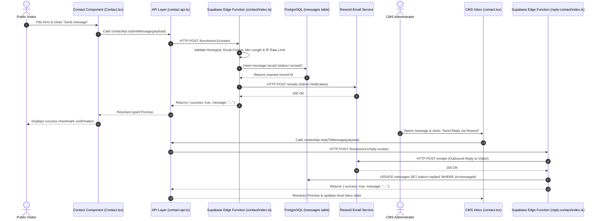
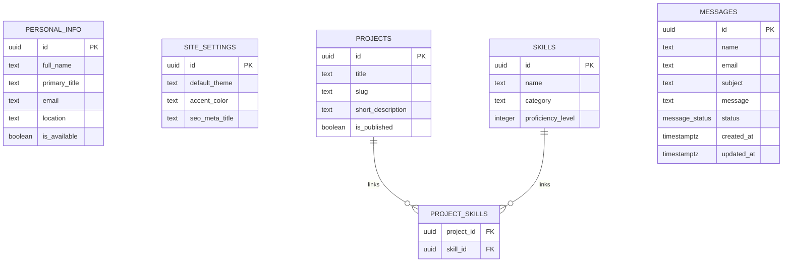
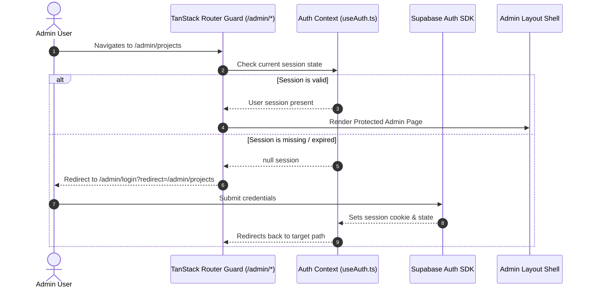

# Portfolio CMS — Complete Master Architectural Documentation (`COMPLETE.md`)

Welcome to the comprehensive master guide for the **Portfolio Content Management System (CMS)**. This document provides an end-to-end overview of the application's architecture, database design, security model, admin control panel, and developer code traces.

---

## 1. Tech Stack Overview

| Component | Technology | Purpose |
| :--- | :--- | :--- |
| **Frontend Framework** | React 18, TypeScript, Vite | High-performance interactive UI rendering with full type safety |
| **Routing** | TanStack Router | File-based type-safe client-side routing & route guards |
| **Styling** | Vanilla CSS, Tailwind CSS | Custom dark glassmorphism design system & micro-animations |
| **State & Data Fetching** | TanStack Query | Query caching, background revalidation, and static offline fallbacks |
| **Database & Storage** | Supabase (PostgreSQL, Storage) | Relational database, SQL Row Level Security (RLS), and media asset buckets |
| **Authentication** | Supabase Auth | JWT session token management and protected admin routes |
| **Serverless Backend** | Supabase Edge Functions | Deno TypeScript runtime for public API endpoints and business logic |
| **Transactional Email** | Resend API | Automated email notifications for visitor contact form submissions & CMS replies |

---

## 2. How Frontend and Backend Connect

---

## 3. Database Structure & Connection (Mermaid ERD)

The PostgreSQL database contains core tables enforcing relational integrity and cascading deletes:

### Row Level Security (RLS) Policy Mechanics
- **`messages` Table**:
  - `anon` (Public visitors): Permitted to submit via the `contact` Edge Function using `SUPABASE_SERVICE_ROLE_KEY` bypass or anonymous insert policy (`with check (true)`).
  - `authenticated` (Admin): Full permissions (`SELECT`, `UPDATE`, `DELETE`) to query and manage messages in the CMS Inbox.
- **Content Tables (`projects`, `skills`, `certificates`, etc.)**:
  - `anon`: Read-only access (`SELECT`) where `is_published = true`.
  - `authenticated`: Full CRUD access (`INSERT`, `UPDATE`, `DELETE`).

---

## 4. Security & Authentication Walkthrough

---

## 5. Admin Panel Integration

The Admin Panel operates under the protected route prefix `/admin/_admin`. It is decoupled from public rendering, allowing full CMS management without impacting public site load speeds or bundling client secrets.

When an administrator saves a change in the CMS (e.g. updating a project or sending a reply to a message), TanStack Query invalidates public cache keys, automatically re-fetching the updated dataset for live public display.

---

## 6. Admin Action → Code Trace Map

| Admin Capability | Frontend Component | API Repository Method | Edge Function / Database Operation |
| :--- | :--- | :--- | :--- |
| **Visitor Submit Message** | [`Contact.tsx`](file:///c:/Users/Manvith%20S%20shetty/Downloads/premium-creator-folio-main/premium-creator-folio-main/src/components/portfolio/Contact.tsx) | [`contactApi.submitMessage()`](file:///c:/Users/Manvith%20S%20shetty/Downloads/premium-creator-folio-main/premium-creator-folio-main/src/lib/api/contact.api.ts) | [`supabase/functions/contact/index.ts`](file:///c:/Users/Manvith%20S%20shetty/Downloads/premium-creator-folio-main/premium-creator-folio-main/supabase/functions/contact/index.ts) → `INSERT INTO public.messages` |
| **Filter & Search Inbox** | [`contact.tsx`](file:///c:/Users/Manvith%20S%20shetty/Downloads/premium-creator-folio-main/premium-creator-folio-main/src/routes/admin/_admin/contact.tsx) | [`contactApi.getMessages()`](file:///c:/Users/Manvith%20S%20shetty/Downloads/premium-creator-folio-main/premium-creator-folio-main/src/lib/api/contact.api.ts) | `SELECT * FROM public.messages WHERE status = $1 AND ... ORDER BY created_at DESC RANGE $2 TO $3` |
| **Auto-Mark Read / Status** | [`contact.tsx`](file:///c:/Users/Manvith%20S%20shetty/Downloads/premium-creator-folio-main/premium-creator-folio-main/src/routes/admin/_admin/contact.tsx) | [`contactApi.updateMessageStatus()`](file:///c:/Users/Manvith%20S%20shetty/Downloads/premium-creator-folio-main/premium-creator-folio-main/src/lib/api/contact.api.ts) | `UPDATE public.messages SET status = $1 WHERE id = $2` |
| **Send Admin Reply via SMTP** | [`contact.tsx`](file:///c:/Users/Manvith%20S%20shetty/Downloads/premium-creator-folio-main/premium-creator-folio-main/src/routes/admin/_admin/contact.tsx) | [`contactApi.replyToMessage()`](file:///c:/Users/Manvith%20S%20shetty/Downloads/premium-creator-folio-main/premium-creator-folio-main/src/lib/api/contact.api.ts) | [`supabase/functions/reply-contact/index.ts`](file:///c:/Users/Manvith%20S%20shetty/Downloads/premium-creator-folio-main/premium-creator-folio-main/supabase/functions/reply-contact/index.ts) → Resend SMTP & `UPDATE messages SET status='replied'` |
| **Delete Message** | [`contact.tsx`](file:///c:/Users/Manvith%20S%20shetty/Downloads/premium-creator-folio-main/premium-creator-folio-main/src/routes/admin/_admin/contact.tsx) | [`contactApi.deleteMessage()`](file:///c:/Users/Manvith%20S%20shetty/Downloads/premium-creator-folio-main/premium-creator-folio-main/src/lib/api/contact.api.ts) | `DELETE FROM public.messages WHERE id = $1` |
| **Upsert Project** | [`projects.tsx`](file:///c:/Users/Manvith%20S%20shetty/Downloads/premium-creator-folio-main/premium-creator-folio-main/src/routes/admin/_admin/projects.tsx) | [`adminApi.upsertProject()`](file:///c:/Users/Manvith%20S%20shetty/Downloads/premium-creator-folio-main/premium-creator-folio-main/src/lib/api/admin.api.ts) | `UPSERT INTO public.projects` & Sync `project_skills` |
| **Upload Media Asset** | [`media.tsx`](file:///c:/Users/Manvith%20S%20shetty/Downloads/premium-creator-folio-main/premium-creator-folio-main/src/routes/admin/_admin/media.tsx) | [`mediaApi.uploadMedia()`](file:///c:/Users/Manvith%20S%20shetty/Downloads/premium-creator-folio-main/premium-creator-folio-main/src/lib/api/media.api.ts) | `supabase.storage.from(bucket).upload()` & Insert `media_files` |

*(Note: File line references reflect current build state and may drift as new features are added).*
