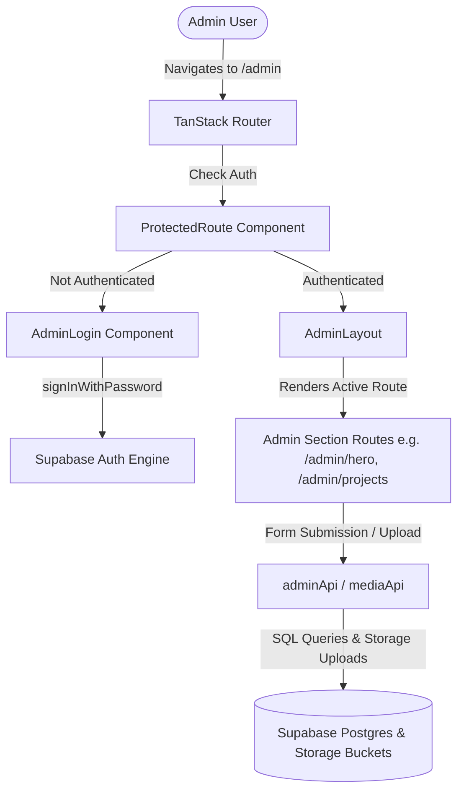

# Comprehensive Beginner's Guide: Building the `/admin` CMS Panel with React, TanStack Router & Supabase

Welcome! This document provides a **complete, step-by-step beginner guide** explaining how the Admin Control Panel (Content Management System) was built for this portfolio application.

By reading this guide, you will learn:
1. **Architecture & Flow**: How Supabase, React state, TanStack Router, authentication, and database tables interact.
2. **File Structure & Purpose**: Every file involved in creating the admin panel, why it exists, and what it accomplishes.
3. **Line-by-Line Code Breakdown**: Detailed explanations of the exact code lines and logic.

---

## 1. High-Level Architecture Overview



### Data & Authentication Flow Summary:
1. **Database Layer (Supabase)**: Stores portfolio data in PostgreSQL tables (`personal_info`, `projects`, `skills`, `experience`, etc.) and uploads media to Storage Buckets (`portfolio-media`).
2. **Client Config (`src/config/supabase.ts`)**: Initializes `@supabase/supabase-js` client connected to your database URL and API keys.
3. **Authentication Context (`src/hooks/admin/useAuth.ts`)**: Tracks whether an admin user is currently logged in using `supabase.auth.getSession()` and `supabase.auth.onAuthStateChange()`.
4. **Route Protection (`src/components/admin/ProtectedRoute.tsx`)**: Intercepts unauthorized visitors trying to access `/admin/*` and redirects them to `/admin/login`.
5. **Admin Layout (`src/components/admin/layout/AdminLayout.tsx`)**: Provides the sidebar navigation menu, header, sign-out button, and `<Outlet />` for sub-pages.
6. **API Services (`src/lib/api/admin.api.ts` & `media.api.ts`)**: Encapsulates DB operations (`upsert`, `delete`, junction table syncing) and media uploading.

---

## 2. Deep Dive: Key Files, Line-by-Line Logic, and Purpose

Below is the complete catalog of files that construct the `/admin` CMS.

---

### File 1: `src/config/supabase.ts`
**Purpose**: Creates and exports the single Supabase client instance used throughout the app.

#### Code & Detailed Explanation:
```typescript
1: import { createClient } from '@supabase/supabase-js';
2: 
3: const supabaseUrl = import.meta.env.VITE_SUPABASE_URL || '';
4: const supabaseAnonKey = import.meta.env.VITE_SUPABASE_ANON_KEY || '';
5: 
6: if (!supabaseUrl || !supabaseAnonKey) {
7:   console.warn(
8:     'Supabase environment variables (VITE_SUPABASE_URL, VITE_SUPABASE_ANON_KEY) are missing. Falling back to static dataset mode.'
9:   );
10: }
11: 
12: export const supabase = createClient(
13:   supabaseUrl || 'https://placeholder.supabase.co',
14:   supabaseAnonKey || 'placeholder-key'
15: );
```

* **Line 1**: Imports `createClient` from `@supabase/supabase-js`, the SDK library used to communicate with Supabase backend services.
* **Lines 3-4**: Reads the public environment variables set in `.env` (`VITE_SUPABASE_URL` and `VITE_SUPABASE_ANON_KEY`).
* **Lines 6-10**: Prints a friendly warning if credentials are missing so developer builds don't hard crash.
* **Lines 12-15**: Exports `supabase`. All authentication, database queries, and storage calls will import this instance.

---

### File 2: `src/hooks/admin/useAuth.ts`
**Purpose**: Creates a React Context (`AuthProvider`) that broadcasts user authentication state to the entire app.

#### Code & Detailed Explanation:
```typescript
 1: import React, { createContext, useContext, useEffect, useState } from 'react';
 2: import { Session, User } from '@supabase/supabase-js';
 3: import { supabase } from '@/config/supabase';
 4: 
 5: interface AuthContextType {
 6:   user: User | null;
 7:   session: Session | null;
 8:   isLoading: boolean;
 9:   signOut: () => Promise<void>;
10: }
11: 
12: const AuthContext = createContext<AuthContextType>({ ... });
13: 
14: export const AuthProvider = ({ children }: { children: React.ReactNode }) => {
15:   const [user, setUser] = useState<User | null>(null);
16:   const [session, setSession] = useState<Session | null>(null);
17:   const [isLoading, setIsLoading] = useState(true);
18: 
19:   useEffect(() => {
20:     // Fetch session on initial component mount
21:     supabase.auth.getSession().then(({ data: { session } }) => {
22:       setSession(session);
23:       setUser(session?.user ?? null);
24:       setIsLoading(false);
25:     });
26: 
27:     // Listen for live login/logout state changes
28:     const { data: { subscription } } = supabase.auth.onAuthStateChange((_event, session) => {
29:       setSession(session);
30:       setUser(session?.user ?? null);
31:       setIsLoading(false);
32:     });
33: 
34:     return () => {
35:       subscription.unsubscribe();
36:     };
37:   }, []);
38: 
39:   const signOut = async () => {
40:     await supabase.auth.signOut();
41:     setUser(null);
42:     setSession(null);
43:   };
44: 
45:   return (
46:     <AuthContext.Provider value={{ user, session, isLoading, signOut }}>
47:       {children}
48:     </AuthContext.Provider>
49:   );
50: };
51: 
52: export const useAuth = () => useContext(AuthContext);
```

* **Lines 15-17**: State variables store `user` object, `session` JWT token details, and an `isLoading` boolean.
* **Lines 21-25**: Checks local storage for any existing login session token when the page loads.
* **Lines 28-32**: Subscribes to Supabase auth state changes (e.g. when user clicks login or logout).
* **Lines 39-43**: Defines `signOut()` function which clears tokens on Supabase and resets React state.
* **Lines 57-63**: Custom hook `useAuth()` allows any component to quickly access `user`, `isLoading`, and `signOut`.

---

### File 3: `src/components/admin/ProtectedRoute.tsx`
**Purpose**: Acts as a guard component to protect private admin routes.

#### Code & Detailed Explanation:
```typescript
 1: import React from 'react';
 2: import { Navigate, useLocation } from '@tanstack/react-router';
 3: import { useAuth } from '@/hooks/admin/useAuth';
 4: 
 5: export const ProtectedRoute: React.FC<{ children: React.ReactNode }> = ({ children }) => {
 6:   const { user, isLoading } = useAuth();
 7:   const location = useLocation();
 8: 
 9:   if (isLoading) {
10:     return (
11:       <div className="flex h-screen w-full items-center justify-center bg-slate-950 text-slate-200">
12:         <div className="flex flex-col items-center gap-4">
13:           <div className="h-10 w-10 animate-spin rounded-full border-4 border-cyan-500 border-t-transparent" />
14:           <p className="text-sm font-medium text-slate-400">Verifying session...</p>
15:         </div>
16:       </div>
17:     );
18:   }
19: 
20:   if (!user) {
21:     return <Navigate to="/admin/login" search={{ redirect: location.pathname }} replace />;
22:   }
23: 
24:   return <>{children}</>;
25: };
```

* **Lines 9-18**: While Supabase checks if token is valid (`isLoading === true`), renders a loading spinner.
* **Lines 20-22**: If `user` is `null` (not logged in), redirects immediately to `/admin/login` passing the target URL path so the user can be redirected back after logging in.
* **Line 24**: If `user` exists, renders the protected child components (the admin dashboard).

---

### File 4: `src/components/admin/AdminLogin.tsx`
**Purpose**: The login form UI component that authenticates admin users.

#### Code & Detailed Explanation:
```typescript
13: const handleLogin = async (e: React.FormEvent) => {
14:   e.preventDefault();
15:   setError(null);
16:   setIsSubmitting(true);
17: 
18:   try {
19:     const { error: authError } = await supabase.auth.signInWithPassword({
20:       email,
21:       password,
22:     });
23: 
24:     if (authError) {
25:       setError(authError.message);
26:       setIsSubmitting(false);
27:       return;
28:     }
29: 
30:     const redirectTo = search.redirect || '/admin';
31:     navigate({ to: redirectTo as any });
32:   } catch (err: any) {
33:     setError(err.message || 'An unexpected error occurred');
34:     setIsSubmitting(false);
35:   }
36: };
```

* **Line 19**: Calls `supabase.auth.signInWithPassword({ email, password })`. Supabase verifies password hash against auth schema in Postgres.
* **Lines 24-28**: If authentication fails (wrong credentials), displays an alert message box.
* **Lines 30-31**: On success, redirects the admin user to `/admin` dashboard.

---

### File 5: `src/routes/admin/_admin.tsx`
**Purpose**: TanStack Router layout route for all `/admin/*` sub-routes.

#### Code & Detailed Explanation:
```typescript
1: import { createFileRoute } from '@tanstack/react-router';
2: import { ProtectedRoute } from '@/components/admin/ProtectedRoute';
3: import { AdminLayout } from '@/components/admin/layout/AdminLayout';
4: 
5: export const Route = createFileRoute('/admin/_admin')({
6:   component: () => (
7:     <ProtectedRoute>
8:       <AdminLayout />
9:     </ProtectedRoute>
10:   ),
11: });
```

* **Lines 5-10**: Wraps `AdminLayout` inside `ProtectedRoute`. This single file guarantees that **every** nested page inside `/admin/` (like `/admin/projects`, `/admin/hero`, `/admin/skills`) is automatically protected!

---

### File 6: `src/lib/api/admin.api.ts`
**Purpose**: Data Access Layer containing all CRUD mutations for CMS tables.

#### Key Functions Explained:

##### 1. `upsertPersonalInfo` (Hero & About content)
```typescript
 9: async upsertPersonalInfo(info: Partial<PersonalInfoDTO>): Promise<void> {
10:   const payload = {
11:     ...(info.id ? { id: info.id } : {}),
12:     full_name: info.fullName,
13:     primary_title: info.primaryTitle,
14:     bio: info.bio,
15:     photo_url: info.photoUrl,
       ...
27:   };
28: 
29:   const { error } = await supabase.from('personal_info').upsert(payload);
30:   if (error) throw error;
31: }
```
* **Why Upsert?**: `upsert` inserts a new row if `id` does not exist, or updates the row if `id` matches.

##### 2. `upsertProject` with Junction Table Sync (`project_skills` & `project_screenshots`)
```typescript
 87: async upsertProject(project: Partial<ProjectDTO>): Promise<void> {
 88:   const payload = { ... };
104:   const { data: projectRow, error: projectError } = await supabase
105:     .from('projects')
106:     .upsert(payload)
107:     .select('id')
108:     .single();
109: 
110:   if (projectError) throw projectError;
111:   const projectId = projectRow.id;
112: 
113:   // Sync Many-to-Many project_skills junction table
114:   if (project.skillIds !== undefined) {
115:     await supabase.from('project_skills').delete().eq('project_id', projectId);
116: 
117:     if (project.skillIds.length > 0) {
118:       const skillRows = project.skillIds.map((skillId) => ({
119:         project_id: projectId,
120:         skill_id: skillId,
121:       }));
122:       await supabase.from('project_skills').insert(skillRows);
123:     }
124:   }
```
* **Junction Table Sync Logic**: When a project is saved with selected skills, the old links in `project_skills` are deleted, and new links are inserted. This clean reset prevents orphaned relational entries.

---

### File 7: `src/lib/api/media.api.ts`
**Purpose**: Handles file upload to Supabase Storage Buckets and audit logging into `media_files` table.

#### Code & Detailed Explanation:
```typescript
 6: async uploadMedia(file: File, bucketName: string, subfolder: string = ''): Promise<string> {
 7:   const fileExt = file.name.split('.').pop();
 8:   const cleanFileName = file.name.replace(/[^a-zA-Z0-9.-]/g, '_');
 9:   const storagePath = subfolder 
10:     ? `${subfolder}/${Date.now()}_${cleanFileName}`
11:     : `${Date.now()}_${cleanFileName}`;
12: 
13:   // 1. Upload file binary to Supabase Storage
14:   const { error: uploadError } = await supabase.storage
15:     .from(bucketName)
16:     .upload(storagePath, file, { upsert: true });
17: 
18:   if (uploadError) throw uploadError;
19: 
20:   // 2. Obtain Public URL for display
21:   const { data: urlData } = supabase.storage
22:     .from(bucketName)
23:     .getPublicUrl(storagePath);
24: 
25:   const publicUrl = urlData.publicUrl;
26: 
27:   // 3. Log row into database media_files for media manager tracking
28:   await supabase.from('media_files').insert({
29:     file_name: file.name,
30:     storage_path: storagePath,
31:     bucket_name: bucketName,
32:     mime_type: file.type || 'application/octet-stream',
33:     file_size_bytes: file.size,
34:   });
35: 
36:   return publicUrl;
37: }
```
* **Step 1**: Uploads file to Supabase Storage (`supabase.storage.from(bucketName).upload(...)`).
* **Step 2**: Retrieves public CDN URL using `getPublicUrl(...)`.
* **Step 3**: Records metadata in `media_files` table for media library management.

---

### File 8: `src/routes/admin/_admin/hero.tsx` (Example Admin Page)
**Purpose**: An admin editor page allowing live modification of hero section text and photo.

#### Code & Detailed Explanation:
```typescript
32: useEffect(() => {
33:   publicApi.getPersonalInfo().then((info) => {
34:     if (info) {
35:       setFormData({
36:         id: info.id,
37:         fullName: info.fullName || '',
            ...
47:       });
48:     }
49:   });
50: }, []);

53: const handleSave = async (e: React.FormEvent) => {
54:   e.preventDefault();
55:   setIsSaving(true);
56:   try {
57:     await adminApi.upsertPersonalInfo(formData as any);
58:     setSaveSuccess(true);
59:   } catch (err: any) {
60:     alert(err.message || 'Failed to save');
61:   } finally {
62:     setIsSaving(false);
63:   }
64: };
```
* **Lines 32-50**: `useEffect` runs once on load, fetching current hero data from DB into React `formData` state.
* **Lines 53-64**: `handleSave` triggers on form submit, calling `adminApi.upsertPersonalInfo(formData)` to update Supabase.

---

## 3. Database & Security (Supabase RLS)

In `supabase/schema.sql`, Row Level Security (RLS) guarantees data safety:

```sql
-- Enable RLS on tables
ALTER TABLE personal_info ENABLE ROW LEVEL SECURITY;
ALTER TABLE projects ENABLE ROW LEVEL SECURITY;

-- Policy 1: Everyone can READ portfolio content (Public Portfolio Website)
CREATE POLICY "Public Read Access" 
ON personal_info FOR SELECT 
USING (true);

-- Policy 2: ONLY Logged-in Admins can INSERT/UPDATE/DELETE (CMS Control Panel)
CREATE POLICY "Admin Full Access" 
ON personal_info FOR ALL 
TO authenticated 
USING (auth.role() = 'authenticated');
```

---

## 4. Summary of Admin Routes Directory

| Route File | Purpose |
| :--- | :--- |
| `src/routes/admin/login.tsx` | Admin login page |
| `src/routes/admin/_admin.tsx` | Protected layout route wrapper |
| `src/routes/admin/_admin/index.tsx` | CMS Dashboard overview & quick stats |
| `src/routes/admin/_admin/hero.tsx` | Edit name, title, bio, photo |
| `src/routes/admin/_admin/about.tsx` | Edit personal story, principles, highlights |
| `src/routes/admin/_admin/projects.tsx` | Add, edit, delete portfolio projects |
| `src/routes/admin/_admin/skills.tsx` | Manage skill categories & proficiencies |
| `src/routes/admin/_admin/experience.tsx` | Manage work experience & roles |
| `src/routes/admin/_admin/education.tsx` | Manage education history |
| `src/routes/admin/_admin/certificates.tsx` | Manage certificates & credentials |
| `src/routes/admin/_admin/achievements.tsx` | Manage awards & achievements |
| `src/routes/admin/_admin/hackathons.tsx` | Manage hackathon participation |
| `src/routes/admin/_admin/media.tsx` | Media manager for uploaded storage files |
| `src/routes/admin/_admin/resume.tsx` | Active PDF resume manager |
| `src/routes/admin/_admin/settings.tsx` | SEO metadata, theme, and site configuration |

---

## Conclusion

You now have a complete step-by-step understanding of how the `/admin` CMS panel is structured, authenticated, guarded, and connected to Supabase!
